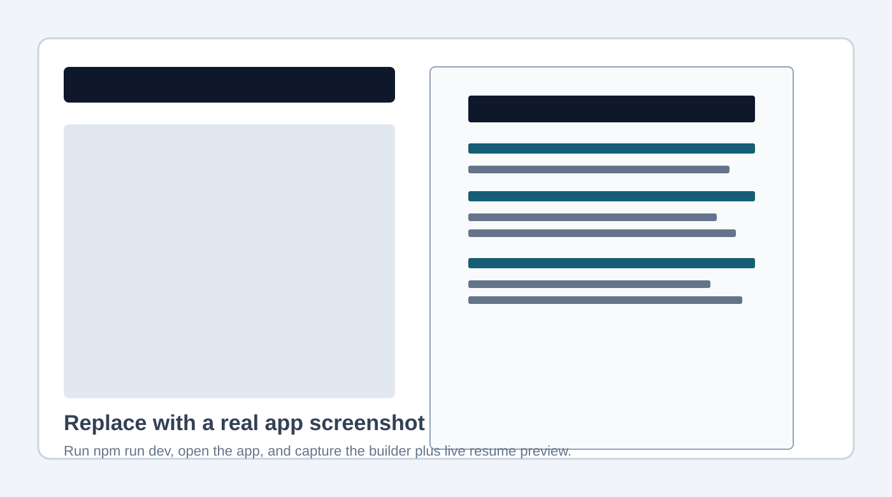

# AI Resume Builder / Smart Resume Studio

A polished, production-quality resume builder built with Next.js, TypeScript, Tailwind CSS, local browser storage, PDF export, and DOCX export. The app is designed for internship, research, PhD, and software engineering applications, with professional templates that stay readable, printable, and ATS-friendly.



> Screenshot note: run the app locally, open `http://127.0.0.1:3000`, and capture the builder plus live preview for the repository image.

## Features

- Resume form builder for contact info, summary, education, experience, projects, skills, publications, awards, leadership, certifications, and custom sections.
- Add, edit, delete, reorder, hide, and show resume sections and entries.
- Live resume preview with safe edit/preview switching on medium screens and split view on very wide screens.
- Three professional templates: Classic ATS, Modern Clean, and Academic CV.
- PDF export using the selected template.
- DOCX export using clean editable Word document structure.
- Print support for letter-sized resume output.
- JSON backup download and import restore.
- Automatic localStorage progress saving.
- Clear data confirmation and one-click sample resume loading.
- Accent color selector, font selector, ATS mode, and dark mode for the app UI.
- Resume writing helpers with action verbs, bullet examples, ATS tips, and content-length guidance.
- Old resume intake: paste or upload `.txt`/`.md` resume text, convert it into structured builder fields, and optionally tailor it to a job description in one flow.
- Job description tailoring that analyzes a pasted role description, matches it against the user's existing qualifications, and applies grounded resume updates without inventing experience.
- Realistic sample profile for Ikteder Akhand Udoy, a CS PhD student focused on ML, computer vision, efficient AI, quantization, LLM systems, and hardware-aware deep learning.

## Tech Stack

- Next.js App Router
- TypeScript
- Tailwind CSS
- Reusable local UI components
- `html2pdf.js` for browser PDF export
- `docx` and `file-saver` for DOCX export
- Local browser storage, no login, no backend, no paid APIs
- Local old-resume parsing heuristics for common resume headings
- Local job-description keyword matching and safe tailoring heuristics
- ESLint and Prettier

## Local Installation

```bash
npm install
```

## Run Locally

```bash
npm run dev
```

Open:

```text
http://127.0.0.1:3000
```

## Production Build

```bash
npm run build
npm run start
```

## Exporting Resumes

- `PDF`: uses the rendered resume preview and downloads a letter-sized PDF.
- `DOCX`: generates a clean editable Word document from the same resume data.
- `Print`: opens the browser print flow using print-friendly resume CSS.
- `JSON`: downloads all resume data so users can restore their progress later.
- `Import`: loads a previously exported JSON backup.

## Building From an Old Resume

1. Open the builder and find `Build from Old Resume`.
2. Paste resume text or upload a `.txt`/`.md` file.
3. Optionally paste a target job description.
4. Click `Build from old resume` to populate the builder.
5. Click `Build and tailor to job` to populate the builder and reorder/draft content around matched qualifications.

PDF and DOCX resumes can still be used by opening the file, copying the text, and pasting it into the intake box. This keeps the app dependency-light and fully local.

## Folder Structure

```text
smart-resume-builder/
|-- app/
|   |-- globals.css
|   |-- layout.tsx
|   `-- page.tsx
|-- components/
|   |-- forms/
|   |   `-- ResumeForm.tsx
|   |-- resume/
|   |   |-- ResumePreview.tsx
|   |   `-- ResumeStudio.tsx
|   `-- ui/
|-- data/
|   `-- sample-resume.ts
|-- docs/
|   `-- screenshot-placeholder.svg
|-- lib/
|   |-- docx-export.ts
|   |-- ids.ts
|   |-- job-tailor.ts
|   |-- resume-parser.ts
|   |-- storage.ts
|   `-- utils.ts
|-- styles/
|   `-- resume.css
|-- types/
`-- README.md
```

## Deploy on Vercel

1. Push this repository to GitHub.
2. Go to Vercel and import the repository.
3. Keep the default Next.js settings.
4. Deploy.

No environment variables are required.

## Quality Checks

```bash
npm run lint
npm run build
npm audit --omit=dev
```

Current validation:

- ESLint passed.
- Production build passed.
- Production dependency audit previously reported zero vulnerabilities.

## Roadmap

- Add drag-and-drop section reordering.
- Add template-specific spacing controls.
- Add cover letter generation from the same profile.
- Add per-role resume variants.
- Add direct PDF/DOCX old-resume parsing with optional parser dependencies.
- Add screenshot export for LinkedIn or portfolio previews.
- Add richer DOCX styling parity with the browser templates.

## License

MIT License. See [LICENSE](./LICENSE).

## Author

Built for Ikteder Akhand Udoy as a polished internship/research showcase project.
